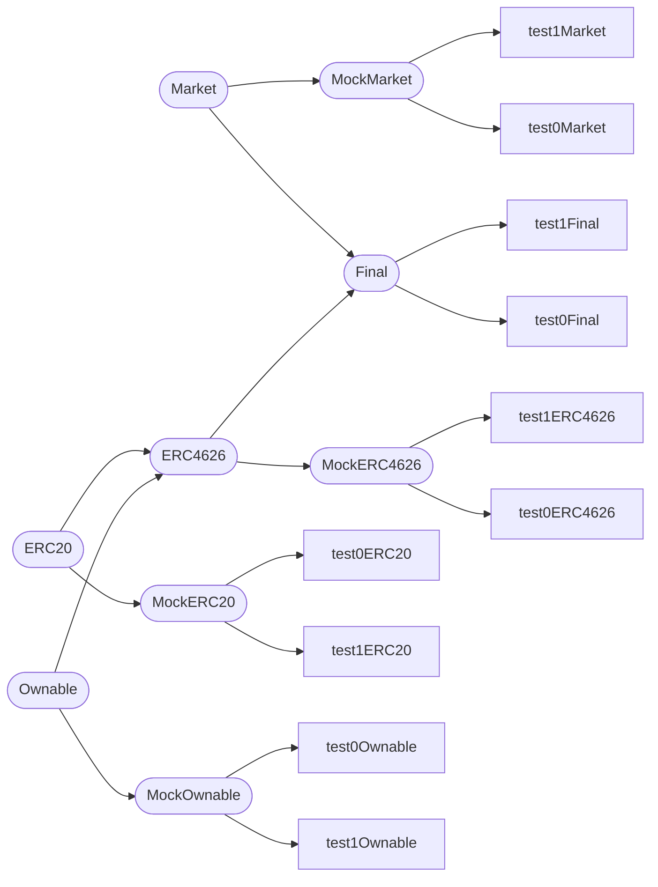
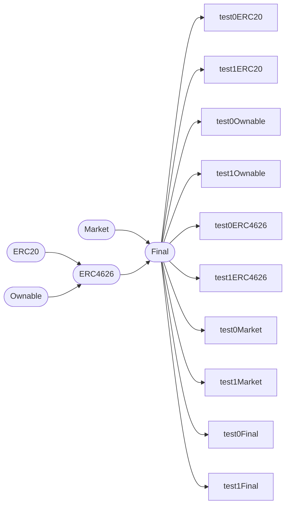
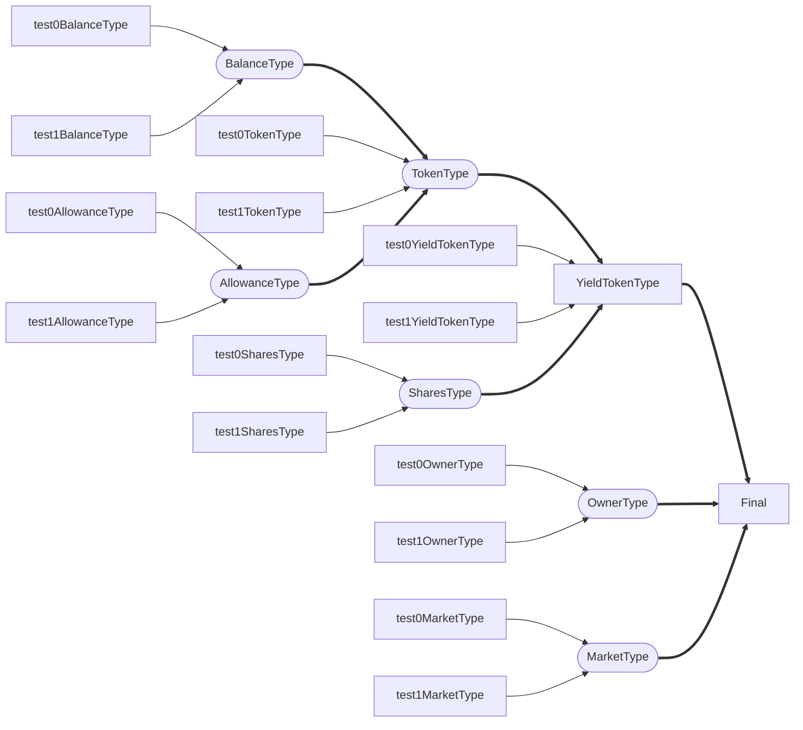

# Type Driven Tokens

the defacto standard for code reuse, modularity, and abstraction in solidity is through object and
interface inheritance, the consequences of which range from hidden interfaces to inheritance hell

an alternate approach is to make types and function application the points of abstraction, which can
expose the entire interface in the final contract, remove the necessity for inheritance, enable more
idomatic api's, and make for significantly simplified in-langauge testing; allowing the testing of
data structures, their function, and their invariants both in isolation and when integrated with
the broader contract.

## Testing

testing type-driven tokens enables tight granularity on test cases;

inheritance based solidity must be tested in one of two ways.

first of which is the mock pattern, where mock contracts inherit abstract contracts, creating public
methods to interface with internal methods directly or indirectly.



second of which is the singleton pattern, where only the final contract is tested, but tests must
account for each parent contract and their interactions. this is uncommon, as the granularity of
tests is far too coarse.



in type-driven solidity, core data types may be defined to encapsulate and constrain storage slots.
by minimizing the storage that each type has access to and by minimizing the functionality of each
morphism, each component is testable without additional interface logic. also, compositions of
types and functions may be tested. finally, the `Final` contract may be interfaced with to
ensure the complete composition and interconnectedness of its inner types may be tested.



## Modularization

modularization with inheritance creates complex inheritance trees with storage layouts and method
overriding that is often unclear and difficult to debug

```solidity
contract A {
    mapping(address => uint256) internal map;

    function readMap(address acct) external view returns (uint256) {
        return map[acct];
    }
}

contract B {
    uint256 public getItem;

    function setItem(uint256 newItem) external {
        getItem = newItem;
    }
}

contract C is B, A {
    function setItem(uint256 newItem) external override {
        getItem = newItem * 2;
    }
}
```

modularization through composition of types and functions enables the same level of modularity
without the inheritance tree, with a more clear trace for each function, and the entire external
interface contained in the final contract explicitly

```solidity
struct Map {
    mapping(address => uint256) inner;
}

using {entry} for Map global;

function entry(Map storage self, address acct) view returns (uint256) {
    return self.inner[acct];
}

struct Item {
    uint256 inner;
}

using {get, set} for Item global;

function set(Item storage self, uint256 item) returns (Item storage) {
    self.inner = item;
    return self;
}

function get(Item storage self) returns (uint256) {
    return self.inner;
}

struct CSTore {
    Map map;
    Item item;
}

contract C {
    CSTore self;

    function readMap(address acct) external view returns (uint256) {
        return self.map.entry(acct);
    }

    function getItem() external view returns (uint256) {
        return self.item.get();
    }

    function setItem(uint256 newItem) external {
        self.item.set(newItem * 2);
    }
}
```
